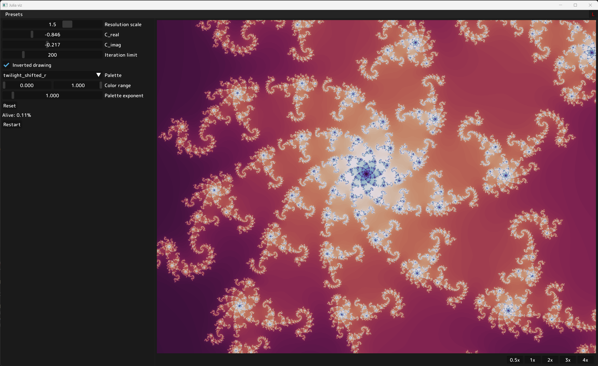

# Turbo-Guacamole: Simple Fractal Renderer

# Setup

1. `git clone https://github.com/harskish/turbo-guacamole.git && cd turbo-guacamole`
2. `pip install pyviewer torch --index-url https://download.pytorch.org/whl/cu118`
3. `python main.py`
